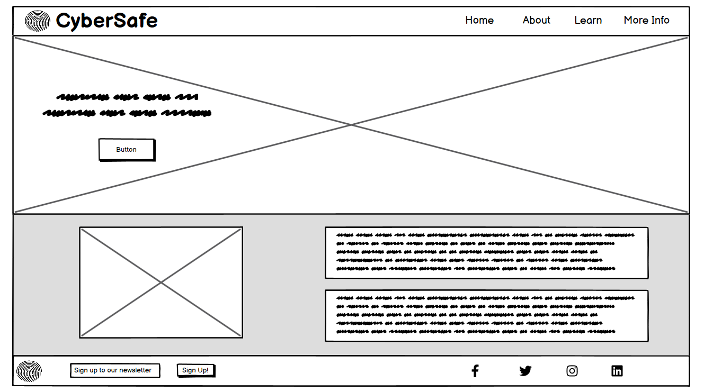
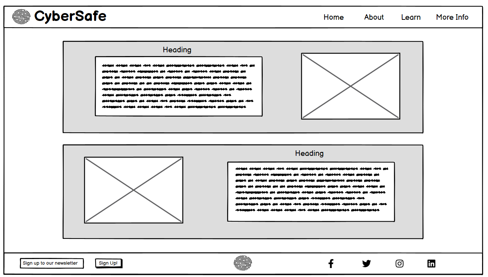
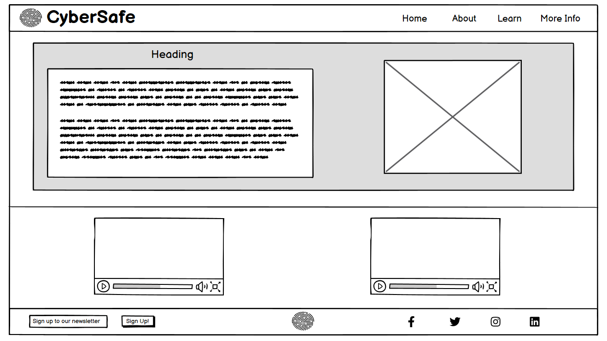
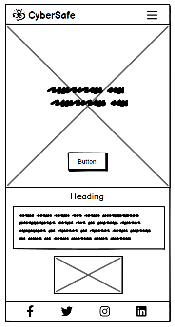
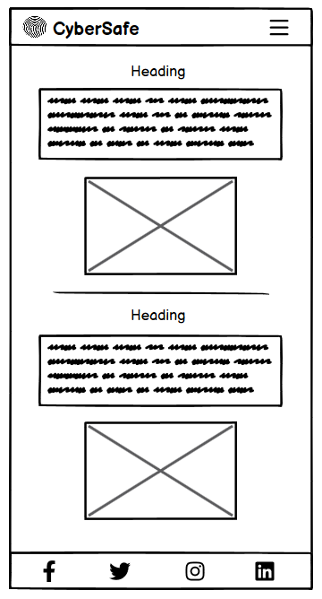
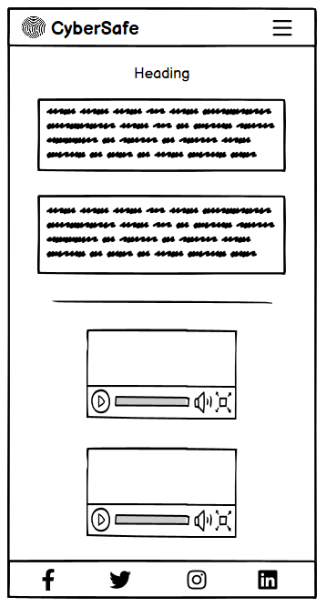
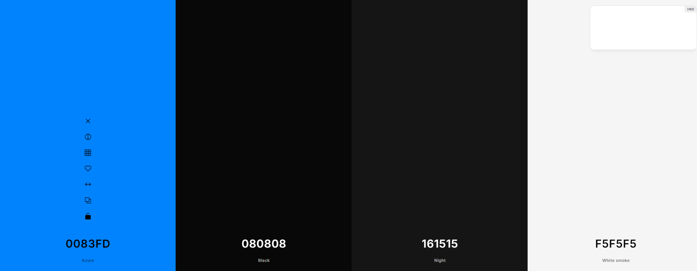
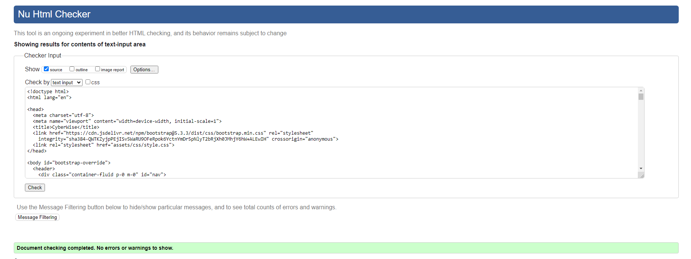
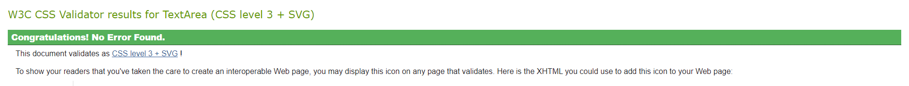

# CyberSafe

## Overview
CyberWise is a website designed to inform users on the fundamentals of cybersecurity and  protecting sensitive information. The website acts as a starting point for information regarding cybersecurity, presenting the key information surrounding its importance in todays society. Alongside this, the website also includes relevant resources, articles and videos so users can further their knowledge on the topic. CyberWise also aims to make users aware of the potential dangers online in attempt to create a safer online environment for everyone. The website is designed to cater for any user no matter their expertise on the subject by providing information that is concise and clear in a simple layout.

### User Stories

- As a user, I want to be able to view information on the topic that is clear and concise.

- As a user, I want to be able to navigate the site quickly via a menu / menu bar.

- As a user, I would like to be able to find relevant information easily.

- As a user, I want access to tips and guidelines on how to protect sensitive information and signs to look out for.

- As a user, I would like access to further resources on the topic.

- As a user, I want access to social media accounts to follow for additional info.

- As a user, I want the option to sign up for a newsletter regarding updates and news on the topic.

## Design

### Wireframes

Wireframe - desktop 1

Wireframe - desktop 2

Wireframe - desktop 3

Wireframe - mobile 1

Wireframe - mobile 2

Wireframe - mobile 3

### Colour Scheme
- For the colour scheme I used a limited amount of colours with the majority of the website being a black background and white text. A vibrant blue was used alongside this to highlight certain elements and features such as buttons, menu items and content sections. 

- The page was designed to be simple and to focus on the content hence the colours chosen.

  

## Features

## Testing and validation

### Testing Results

### Validation

## Deployment

## Fixes and Bugs

## Credits

## Future Improvements