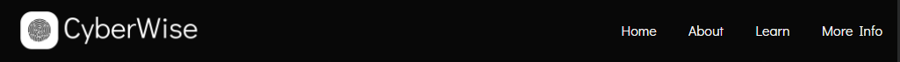
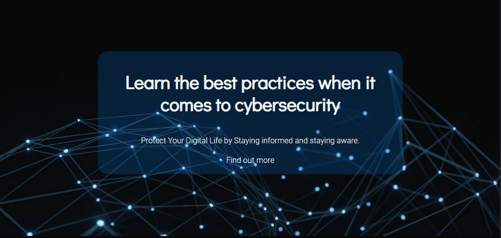
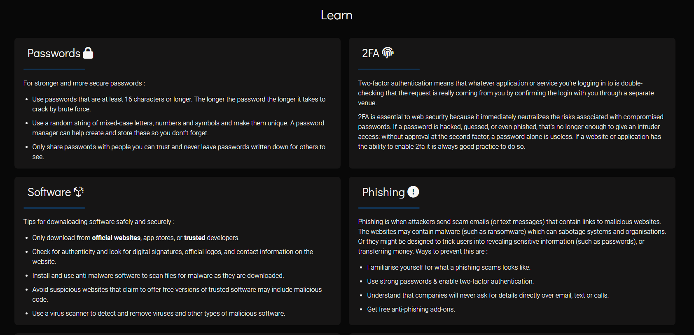
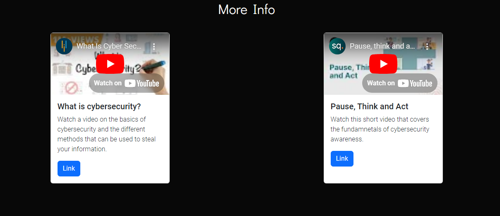

# CyberSafe

## Overview

[View live project here](https://m-dixon5.github.io/CyberWise-Project/)

CyberWise is a website designed to inform users on the fundamentals of cybersecurity and  protecting sensitive information. The website acts as a starting point for information regarding cybersecurity, presenting the key information surrounding its importance in todays society. Alongside this, the website also includes relevant resources, articles and videos so users can further their knowledge on the topic. CyberWise also aims to make users aware of the potential dangers online in attempt to create a safer online environment for everyone. The website is designed to cater for any user no matter their expertise on the subject by providing information that is concise and clear in a simple layout.

### User Stories

- As a user, I want to be able to view information on the topic that is clear and concise.

- As a user, I want to be able to navigate the site quickly via a menu / menu bar.

- As a user, I would like to be able to find relevant information easily.

- As a user, I want access to tips and guidelines on how to protect sensitive information and signs to look out for.

- As a user, I would like access to further resources on the topic.

- As a user, I want access to social media accounts to follow for additional info.

- As a user, I want the option to sign up for a newsletter regarding updates and news on the topic.

## Design

### Wireframes

Wireframe - desktop 1

Wireframe - desktop 2

Wireframe - desktop 3

Wireframe - mobile 1

Wireframe - mobile 2

Wireframe - mobile 3

### Colour Scheme
- For the colour scheme I used a limited amount of colours with the majority of the website being a black background and white text. A vibrant blue was used alongside this to highlight certain elements and features such as buttons, menu items and content sections. 

- The page was designed to be simple and to focus on the content hence the colours chosen.

  

## Features
- Navbar

  

- Hero section

- Learn information cards

- Embedded videos

Social media links in footer

## Testing and validation

### Testing Results
A range of devices were used when testing the functionality of the website. This included both real-world devices and the ones provided on developer tools.

The devices included were :

- iPhone 11 pro max (real-world)
- Google Pixel 7 (real-world)
- iPad pro 2021 (real-world)
- Alienware AW2521HF 24.5" monitor (real-world)
- iPhone 12 (dev-tools)
- Asus Zenbook Fold (dev-tools)

### Validation
HTML validation

 

CSS validation

## Deployment
Here are the steps taken to deploy the website :

- Go to github.com/m-dixon5.
- Select the CyberWise-Project repositry.
- Open the settings tab located near the top of the screen.
- Use the menu bar on the left to navigate to the pages section.
- In the pages section check the source is set to deploy from a branch.
- Below this in the branch section set the branch to Main and the folder to /root.
- Once you have completed this click save.
- After a minute or so the live project link should appear above.

## Bugs

- Issue with the whole html content being smaller than the page, meaning there is a gap between the content and right-hand side of the screen. This only applies to screen sizes smaller than desktop. It does not effect any functionality.

- Footer and newsletter sign-up section are centered differenty to rest of the content when not viewing on full-screen desktop.

## Credits

### Content
- https://forum.freecodecamp.org/t/youtube-refused-to-connect/245262 (issue with iframes)

- https://kb.blackbaud.com/knowledgebase/Article/95458 (iframe full screen issue)

- https://www.cisa.gov/secure-our-world/use-strong-passwords (content)

- https://www.bu.edu/tech/support/information-security/why-use-2fa/#:~:text=2FA%20is%20essential%20to%20web,a%20password%20alone%20is%20useless. (content)

- https://www.ncsc.gov.uk/guidance/phishing (content)

- https://www.lepide.com/blog/10-ways-to-prevent-phishing-attacks/ (content)

- https://www.kaspersky.com/resource-center/preemptive-safety/how-to-set-up-a-secure-home-network (content)

- https://www.nicybersecuritycentre.gov.uk/social-media-how-secure-your-accounts (content)

- https://www.infosec.ox.ac.uk/protect-my-privacy-online (content)

- https://github.com/amylour (README inspo)

- Google AI (content)

### Media

- https://fontawesome.com/ (Icons)

- https://pixabay.com/ (Images)

- https://www.pexels.com/ (Images)

- https://convertio.co/ (File convertion)

### Testing
- https://validator.w3.org/

- https://jigsaw.w3.org/css-validator/

## Future Improvements

- Add additional helpline information that can be quickly accessed through a button placed in the hero section of the page.

- Implement the unfinished newsletter sign up so users have the oportunity to gain further knowledge on the topic